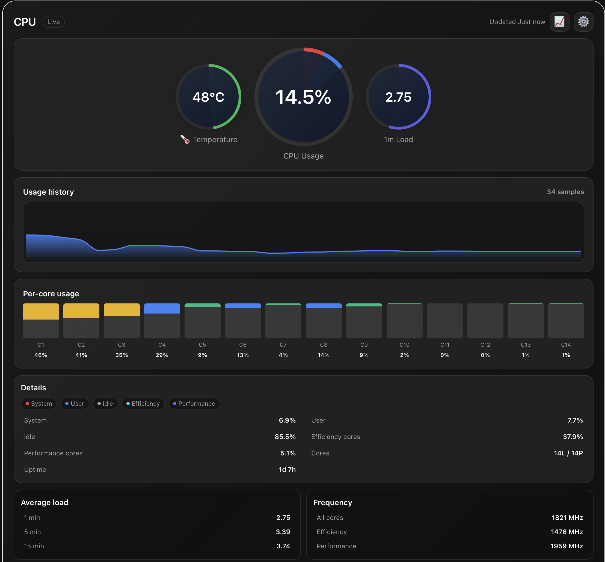

# Stats Tauri

Modern web UI for macOS Stats, built with Tauri + React + TypeScript. Consumes real-time system metrics from the Stats app's HTTP sidecar.

## Screenshot



**Features shown:**
- Dual-segment CPU gauge (system: red, user: blue)
- Real-time temperature and load metrics
- Live usage history chart
- Per-core color-coded bars (14 cores in compact layout)
- Detailed breakdowns (system, user, idle, E-cores, P-cores)
- Average load and frequency metrics
- Top processes (CPU usage, name)

## Quick Start

### 1. Enable CPU Sidecar (one-time setup)

The sidecar is disabled by default. Enable it to expose CPU metrics:

```bash
# From project root
./toggle-sidecar.sh
# Choose option 1, allow restart when prompted
```

Or manually:
```bash
defaults write eu.exelban.Stats enableCpuSidecar -bool true
# Then restart Stats app
```

### 2. Verify Sidecar

```bash
curl http://127.0.0.1:8973/cpu
# Should return JSON with totalUsage, perCoreUsage, temperature, etc.
```

### 3. Run Tauri UI

```bash
cd stats-tauri
npm install
npm run dev
```

The UI will connect to the sidecar and display live CPU metrics.

## Configuration

- **Sidecar disabled by default** (preserves battery life)
- **Restart required** when enabling/disabling
- **Conservative defaults**: 5s process polling (vs 1s for popup)
- **Helper script**: `toggle-sidecar.sh` for easy enable/disable

See [../StatsSidecar/README-SIDECAR.md](../StatsSidecar/README-SIDECAR.md) for battery impact and advanced configuration.

## Architecture

- **Backend**: HTTP sidecar server (BSD sockets) on port 8973
- **Bridge**: NotificationCenter connects Swift CPU module to sidecar store
- **Frontend**: React with Zustand state management, Tailwind styling
- **Data flow**: CPU readers → SidecarStore → HTTP JSON → Tauri UI

## Scripts

- `npm run dev` — Vite dev server + Tauri app
- `npm run build` — Type-check and build
- `npm run lint` — ESLint (TS/React/Tailwind)
- `npm run check` — TypeScript `--noEmit`
- `npm run tauri` — Run Tauri in development mode

## Documentation

- [Sidecar Configuration](../StatsSidecar/README-SIDECAR.md) - Setup, battery impact, troubleshooting
- [Migration Guide](../MIGRATION-GUIDE.md) - Porting RAM/Disk/Network/Battery modules
- [Commit Message](../COMMIT_MESSAGE.md) - Full implementation details
